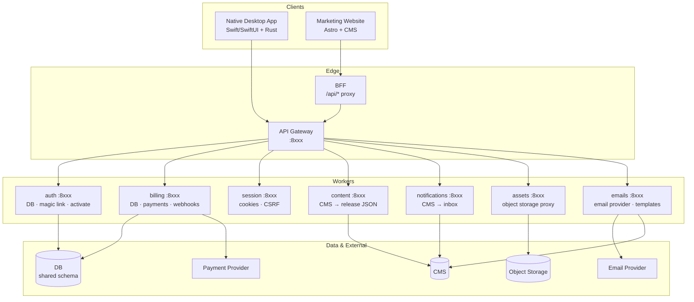
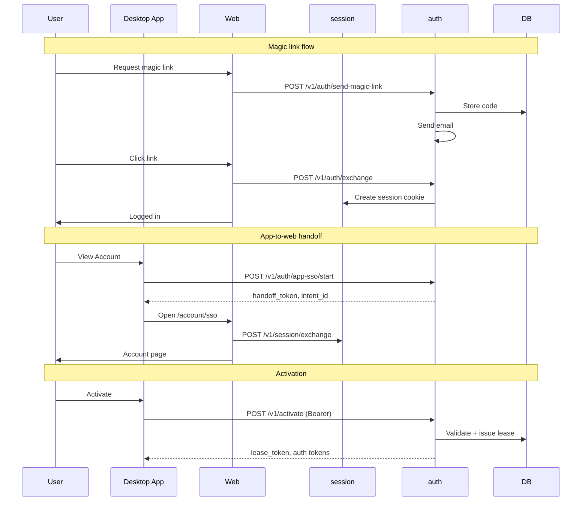
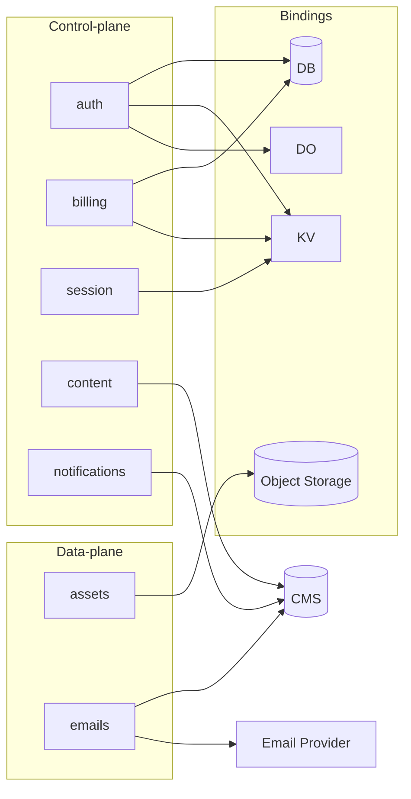
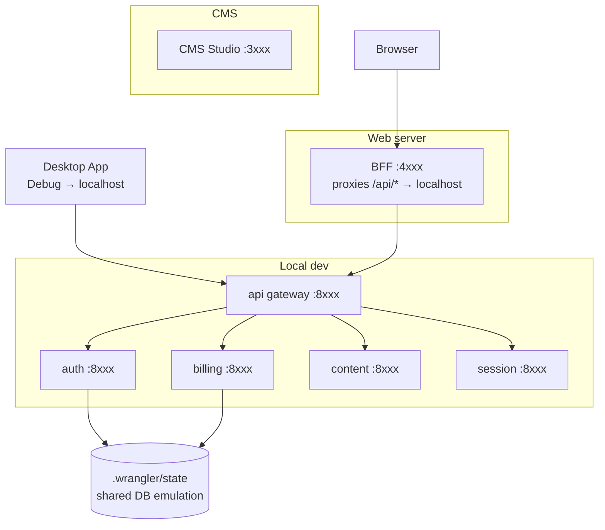
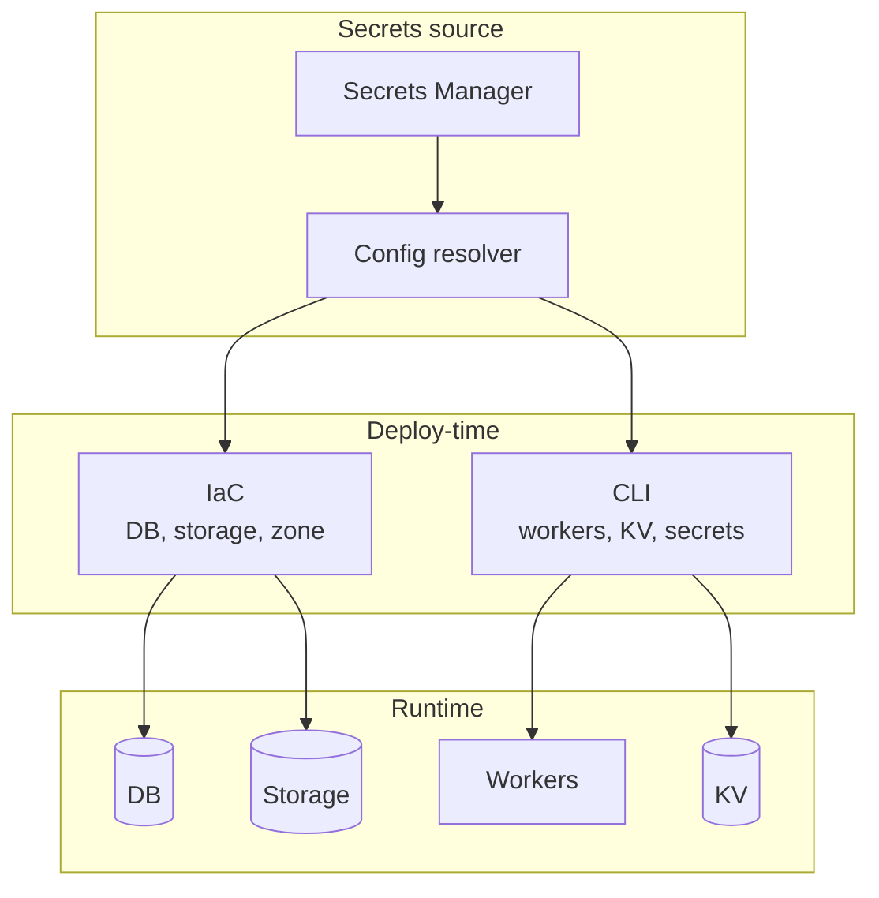

# Architecture Example — Mermaid Diagrams

A shareable example showing Mermaid diagram types (flowchart, sequence) for system architecture documentation.

---

## High-Level Overview

---

## Auth & Licensing Flow

---

## Backend Workers Detail

---

## Local Development Topology

---

## Infrastructure & Secrets

---

## Repo Layout (example)

| Area | Path | Purpose |
|------|------|---------|
| App | `app/` | Native desktop app, optional backend lib |
| Web | `web/` | Marketing site, CMS studio |
| Backend | `backend/` | Workers, IaC, schema |
| Docs | `docs/` | Runbooks, architecture |
